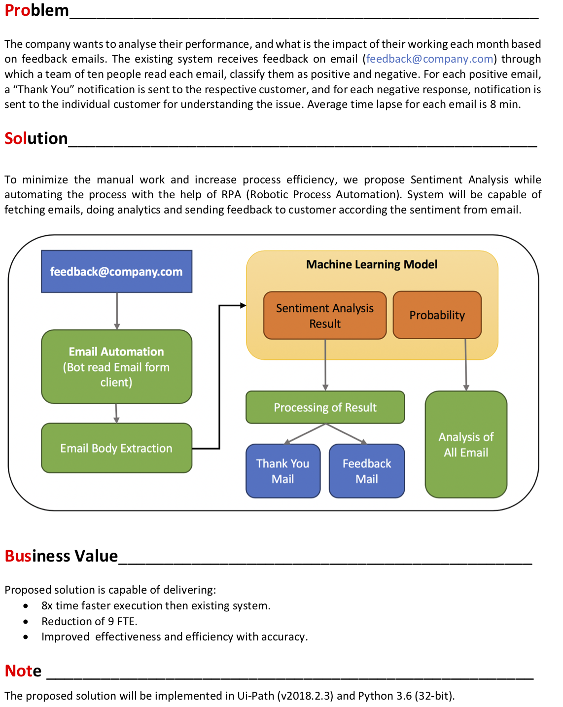
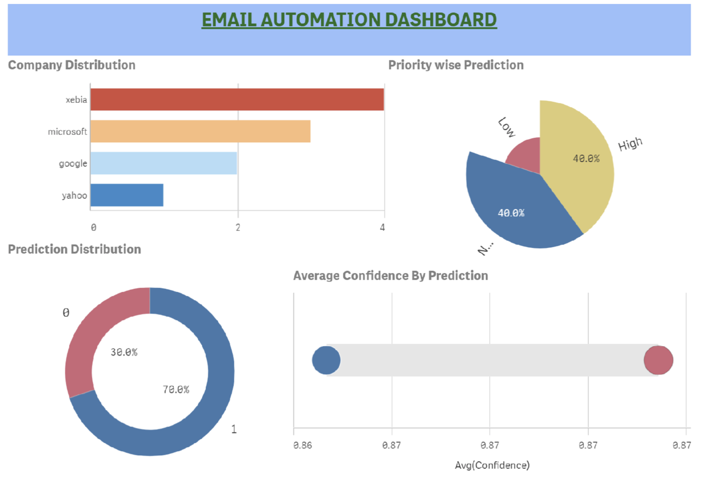
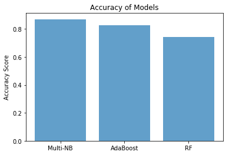
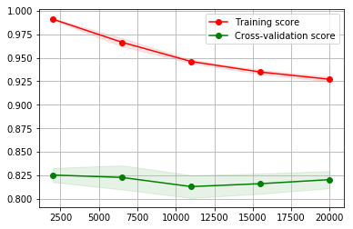

# Email Automation using RPA and Machine Learning




---
## Dashboard  




---


> Note: Dataset used to train the model is imdb reviews.
> To alter the model as per use case we need to change the training data.


## Sentiment Analysis


```python
# import pandas for reading data
import pandas as pd
import numpy as np
```


```python
import platform
platform.architecture()
```


    ('32bit', 'WindowsPE')


```python
# read data from reviews and labels text file
data = pd.read_csv("./reviews.txt",delimiter='\t',header=None,names=['Reviews'])
labels = pd.read_csv("./labels.txt",delimiter='\t',header=None,names=['Labels'])
```


```python
if data.shape == labels.shape:
    print('appropriate data shape found.')
```

    appropriate data shape found.


```python
# map the label name
labels['Labels'] = labels['Labels'].map({'positive':1,'negative':0})
```


```python
# import nltk
import nltk

#if true it will download all the stopwords
if False:
    import nltk
    nltk.download('stopwords')
```


```python
# importing Natural Language Toolkit
from nltk.corpus import stopwords
from sklearn.feature_extraction.text import TfidfVectorizer
from sklearn.feature_extraction.text import CountVectorizer

#if true will create vectorizer with stopwords
if True:
    stopset = set(stopwords.words("english"))
    vectorizer = TfidfVectorizer(stop_words=stopset,binary=True)
```


```python
# Extract feature column 'Text'
X = vectorizer.fit_transform(data['Reviews'])
# Extract target column 'Class'
y = labels['Labels']
```


```python
#Shuffle and split the dataset into the number of training and testing points
if True:
    from sklearn.model_selection import train_test_split
    X_train, X_test, y_train, y_test = train_test_split(X, y, test_size=0.20, train_size=0.80, random_state=42)

# Show the results of the split
print("Training set has {} samples.".format(X_train.shape[0]))
print("Testing set has {} samples.".format(X_test.shape[0]))
```

    Training set has 20000 samples.
    Testing set has 5000 samples.


```python
# Import the models from sklearn
from sklearn.naive_bayes import MultinomialNB
from sklearn.ensemble import RandomForestClassifier
from sklearn.ensemble import AdaBoostClassifier

from sklearn.metrics import f1_score
from sklearn.model_selection import learning_curve,validation_curve
from sklearn.model_selection import KFold

objects = ('Multi-NB','AdaBoost', 'RF')
```


```python
# function to train classifier
def train_classifier(clf, X_train, y_train):    
    clf.fit(X_train, y_train)

# function to predict features
def predict_labels(clf, features):
    return(clf.predict(features))
```


```python
# Initialize the three models
A = MultinomialNB(alpha=1.0,fit_prior=True)
B = AdaBoostClassifier(n_estimators=100)
C = RandomForestClassifier(n_estimators=10, max_depth=None, min_samples_split=2, random_state=0)
```


```python
# loop to call function for each model
clf = [A,B,C]
pred_val = [0,0,0]

for a in range(0,3):
    train_classifier(clf[a], X_train, y_train)
    y_pred = predict_labels(clf[a],X_test)
    pred_val[a] = f1_score(y_test, y_pred)
    print(pred_val[a])
```

    0.8704977741804938
    0.8275996112730807
    0.7414343477335603


```python
# import matplotlib for ploting graph
import matplotlib.pyplot as plt
```


```python
# ploating data for F1 Score
y_pos = np.arange(len(objects))
y_val = [ x for x in pred_val]
plt.bar(y_pos,y_val, align='center', alpha=0.7)
plt.xticks(y_pos, objects)
plt.ylabel('Accuracy Score')
plt.title('Accuracy of Models')
plt.show()
```





```python
# defining the variable for learning curve
size, score, cv = np.linspace(.1, 1.0, 5), 'f1', KFold( n_splits= 5, random_state= 42)

# calling the learning_curve function from defined variables
size, train, test = learning_curve(A, X, y, cv= cv, scoring=score, n_jobs=1, train_sizes=size)

# Mean and standard deviation of train and test score
train_mean,test_mean  =  np.mean( train, axis=1), np.mean( test, axis=1)
train_std,  test_std  =  np.std(train, axis=1) , np.std(test, axis=1)

# Ploating the Grid
plt.grid()

# Ploating the curve
plt.fill_between(size, train_mean - train_std, train_mean + train_std, alpha=0.1,color="r")
plt.fill_between(size,  test_mean - test_std,   test_mean + test_std,  alpha=0.1,color="g")

# Ploating the axis name and legend
plt.plot(size, train_mean, 'o-', color="r",label="Training score")
plt.plot(size, test_mean, 'o-', color="g", label="Cross-validation score")
plt.legend(loc="best");
```





```python
# import pickle and joblib for saving the model
import pickle
from sklearn.externals import joblib
```


```python
# save vertorizer information
with open('TfidfVectorizerModel.pkl','wb') as TfidfVectorizerModel:
    pickle.dump(vectorizer.vocabulary_, TfidfVectorizerModel)
```


```python
# save trained model
with open('MultinomialNBModel.pkl','wb') as MultinomialNBModel:
    joblib.dump(A, MultinomialNBModel)
```
